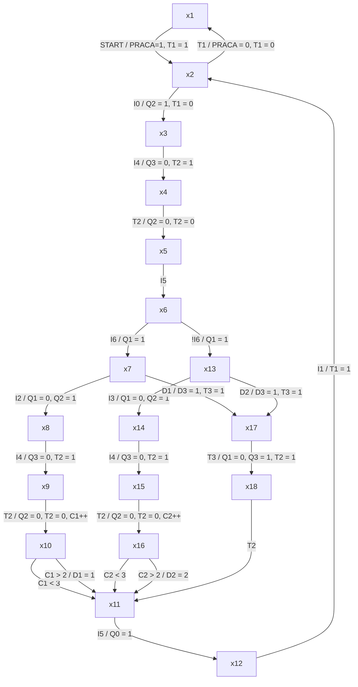
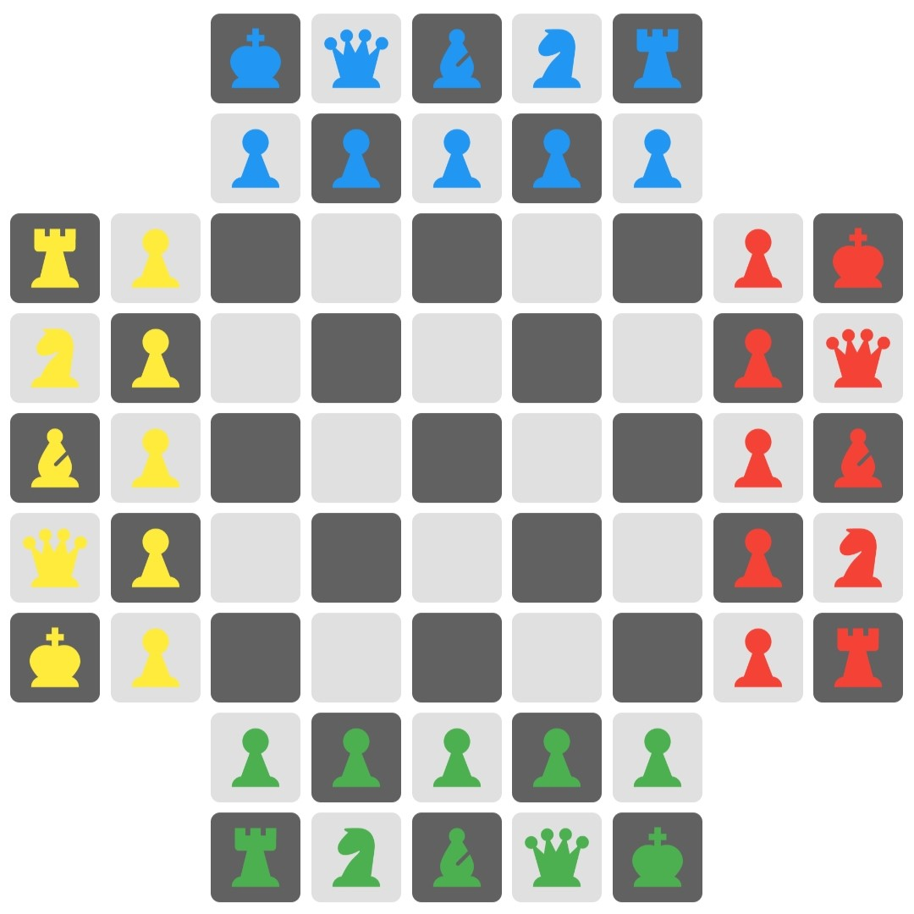

# Opis stanowiska

Detal jest umieszczany w widocznym zagłębieniu położenia początkowego , gdzie przy pomocy czujnika optycznego jest określany jego kolor. Następnie przy pomocy liniowego siłownika pneumatycznego, wyposażonego w mechaniczny chwytak o ruchu pionowym, może być podniesiony, przeniesiony i upuszczony do jednego z dwóch magazynów - pochylni albo ewentualnie na zewnątrz stanowiska. Problemem stanowiska jest widoczna bezwładność zatrzymywania poziomego ruchu manipulatora w odpowiedniej, w miarę precyzyjnej, pozycji - wymaga to właściwego rozwiązania programowego.

Sygnały wejściowe i wyjściowe stanowiska są dostępne pod adresami:

Wejścia cyfrowe:

Symbol | Adres | Opis
-------|-------|-----------------------------
1B1    | I0.0  | Detal podany
1B2    | I0.1  | Chwytak w pozycji startowej
1B3    | I0.2  | Chwytak przy pochylni prawej
1B1    | I0.3  | Chwytak przy pochylni lewej
2B1    | I0.4  | Chwytak opuszczony
2B2    | I0.5  | Chwytak podniesiony
3B1    | I0.6  | Detal nie czarny

Wyjścia cyfrowe:

Symbol | Adres | Opis
-------|-------|--------------------------------------
1M1    | Q0.0  | Chwytak do pozycji startowej (w lewo)
1M2    | Q0.1  | Chwytak do pozycji końcowej (w prawo)
2M1    | Q0.2  | Opuść chwytak
3M1    | Q0.3  | Otwórz chwytak

# Opis stanowiska

Stanowisko składa się z obiektu sterowania, sterownika PLC S7-1200, dotykowego panelu operatorskiego

# Zadanie do wykonania

1. Położenie początkowe:
    - chwytak w pozycji startowej,
    - chwytak podniesiony,
    - chwytak otwarty.
2. Jeśli stanowisko jest w położeniu początkowym, można je wprowadzić w stan gotowości do pracy niestabilnym przyciskiem START, co potwierdzane, jest zapaleniem kontrolki PRACA. W trybie PRACA, jeżeli jest detal do odbioru, to należy opuścić chwytak, zamknąć go w położeniu dolnym, podnieść chwytak z detalem i po całkowitym podniesieniu przenieść go nad odpowiednią pochylnię  (czarny detal - lewą, nie-carny - prawą). Następnie należy opuścić chwytak, otworzyć go w położeniu dolnym i po upuszczeniu detalu podnieść, a  następnie przestawić do pozycji startowej. Ponieważ chwytak nie posiada czujników otwarcia/zamknięcia należy po każdorazowym wydaniu polecenia otwórz/zamknij odczekać 0,5s i po jego upływie wykonywać dalsze ruchy.
3. Jeżeli od chwili powrotu chwytaka do pozycji startowe, przez 4s nie pojawi się kolejny detal do przeniesienia, to należy wyłączyć tryb PRACA (zgasić kontrolkę).
4. Detale na każdej pochylni powinny być niezależnie zliczane. Po upuszczeniu trzeciego detalu (otwarciu nad pochylnią opuszczonego chwytaka) należy dla tej pochylni załączyć migającą kontrolkę: LEWA/PRAWA POCHYLNIA PEŁNA. Chwytak powinien w zwykły sposób powrócić do pozycji startowej. Migająca dioda powinna spowodować usunięcie przez operatora wszystkich detali z danej pochylni i potwierdzenie tego faktu niestabilnym przyciskiem odrębnym dla każdej pochylni: LEWA/PRAWA POCHYLNIA OPRÓŻNIONA. Miganie kontrolki powiązanej z konkretną pochylnią powinno zablokować przeniesienie detalu odkładanego na tę pochylnię.
5. Można wymusić przeniesienie detalu mimo zapełnienia "jego" pochylni przez naciśnięcie przycisku wspólnego dla obu rodzajów detali: TRANSPORT AWARYJNY. Wtedy chwytak powinien przenieść detal do pozycji skrajnej prawej (poza stanowisko) i tam upuścić go w zwykły sposób. Przez cały czas takiego przeniesienia przycisk TRANSPORT AWARYJNY powinien migać (podświetlenie). Pozycja skrajna prawa jest pozbawiona czujnika (blokada mechaniczna). Dotarcie chwytaka do niej należy określić przez dobór czasu opóźnienia po minięciu przez chwytak czujnika nad prawą pochylnią.
6. Sterowanie przesuwaniem chwytaka:
    - 1M1 = 1 przy 1M2 = 0 - przesuwaj chwytak w lewo i stój na lewej blokadzie,
    - 1M1 = 0 przy 1M2 = 1 - przesuwan chwytak w prawo i stój na prawej blokadzie,
    - 1M1 = 1M2 = 0 - chwytak zatrzymuje się w aktualnej pozycji,
    - 1M1 = 1M2 = 1 - wcześniejsza z jedynek wymusza a. lub b. - stan zabroniony.
7. Sterowanie opuszczaniem/otwieraniem chwytaka:
    - 2M1 / 3M1 = 1 - opuszczaj / otwieraj i utrzymaj ten stan,
    - 2M1 / 3M1 = 0 - podnoś / zamykaj i utrzymaj ten stan.

# Algorytm działania

<!-- ```{.mermaid caption="Test mermaid"} -->



# Panel dotykowy HMI

<!--  -->
